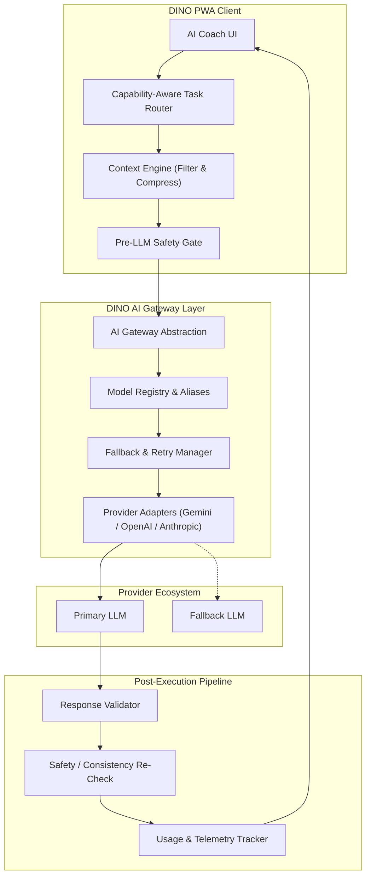
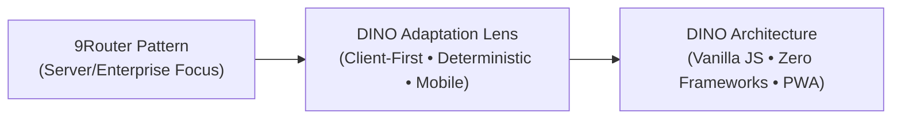
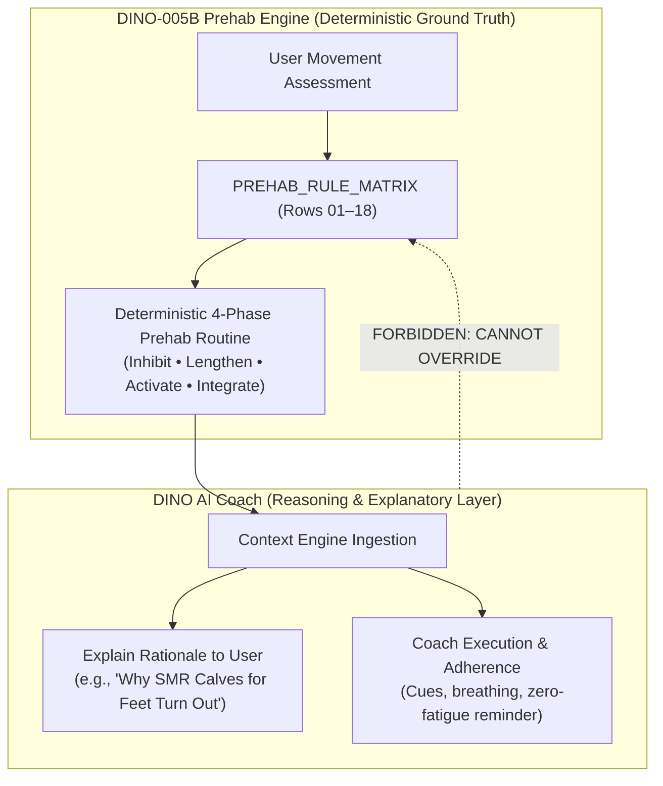

# DINO-ARCH-001 — DINO AI COACH ARCHITECTURE LEARNING NOTES (9ROUTER)

> **Document ID:** DINO-ARCH-001
> **Topic:** AI Coach Architecture Evolution — Learning from 9Router (`decolua/9router`)
> **Status:** ARCHITECTURE NOTE / SPECIFICATION READY (NO IMPLEMENTATION AUTHORIZED)
> **Authority:** DINO (Project Owner / Founder)
> **Implementer:** Antigravity (Implementation Agent)
> **Source References:**
> - 9Router Open-Source Repository: `decolua/9router`
> - Founder Guidance Document: *"DINO AI COACH — KIẾN TRÚC MỚI HỌC TỪ 9ROUTER"*

---

## 1. PURPOSE

### 1.1 Why DINO Studies 9Router
DINO currently utilizes a minimal, proof-of-concept AI Coach implementation in [`js/ai_coach.js`](file:///c:/Users/ADMIN/Desktop/DinoHybridTracking/js/ai_coach.js). While functional for basic interactions, this baseline is tightly coupled to a single provider, lacks model abstraction, passes uncompressed and unvalidated context, possesses no fallback mechanism if the vendor API experiences rate limits or outages, and does not enforce deterministic safety guardrails.

9Router (`decolua/9router`) is an open-source multi-provider routing and gateway engine. It solves critical production challenges in LLM integration:
1. **Decoupled Provider Management:** Shielding application logic from vendor-specific payload schemas, headers, and authentication idiosyncrasies.
2. **Resilience & Fault Tolerance:** Automatic error classification, exponential backoff, cooldowns, and fallback routing across diverse model tiers.
3. **Task-Aware Routing:** Matching specific task requirements (latency, reasoning depth, context size, cost) to the optimal model rather than routing all queries through a single monolithic endpoint.
4. **Context & Budget Optimization:** Structured context extraction, relevance filtering, and token compression to prevent bloated prompts and excessive latency.

### 1.2 Architectural Learning vs. Framework Adoption
**This document represents an architectural learning exercise, NOT a framework adoption.**
- DINO **DOES NOT** install the 9Router npm package, import its codebase, or adopt its runtime dependencies.
- DINO **DOES NOT** pivot to a cloud-first gateway daemon or complex server-side orchestration stack.
- DINO **EXTRACTS** the high-value architectural patterns demonstrated by 9Router and refines them into a lightweight, client-first, vanilla JavaScript PWA implementation that aligns perfectly with DINO's Product Constitution and deterministic tracking invariants.

---

## 2. ADOPT: ARCHITECTURAL PATTERNS LEARNED FROM 9ROUTER

The following 14 architectural patterns from 9Router are identified as directly beneficial and are formally adopted into the future DINO AI Coach architectural blueprint:



### 2.1 AI Gateway Abstraction
- **Pattern:** Introduce a centralized gateway interface separating client UI logic from external AI services.
- **DINO Application:** Rather than having UI handlers make raw `fetch` calls to vendor endpoints, all AI requests are routed through a single `AIGateway` contract. The gateway coordinates task routing, adapter invocation, retry logic, and telemetry.

### 2.2 Provider Adapter Pattern
- **Pattern:** Isolate vendor-specific request/response schemas behind polymorphic adapters conforming to a unified internal interface (`generateText`, `generateStructured`, `streamText`).
- **DINO Application:** Dedicated adapters for supported providers (e.g. Google Gemini, OpenAI, Anthropic, DeepSeek). If an API changes its request format or authentication headers, only the specific adapter is updated, leaving application logic completely untouched.

### 2.3 Model Registry & Model Aliases
- **Pattern:** Abstract physical model strings (e.g., `gemini-1.5-flash-002`, `gpt-4o-mini-2024-07-18`) behind semantic role aliases.
- **DINO Application:** DINO defines canonical model aliases based on operational requirements:
  - `dino-fast`: Low-latency, lightweight models for quick chat, set validation, or immediate encouragement.
  - `dino-reasoning`: High-capability models for complex weekly progression reviews, plateau analysis, or multi-week volume adjustments.
  - `dino-long-context`: Models equipped to ingest long multi-month training histories for macrocycle summaries.
  - `dino-fallback`: Reliable, high-availability baseline model used when primary tiers are degraded.

### 2.4 Capability-Aware Task Router
- **Pattern:** Route incoming queries dynamically based on the nature of the task rather than sending all interactions to one default model.
- **DINO Application:** A deterministic `TaskRouter` classifies user prompts or system triggers into task categories (e.g., `QUICK_LOG_INTERPRETATION`, `WORKOUT_DEBRIEF`, `WEEKLY_ANALYTICS`, `EXERCISE_CUE_EXPLANATION`) and routes each to the model alias best suited in speed, context window, and reasoning depth.

### 2.5 Error Classification
- **Pattern:** Categorize raw HTTP and network exceptions into distinct, actionable domain error types.
- **DINO Application:** Errors are classified into standardized types:
  - `RATE_LIMIT_EXCEEDED` (HTTP 429) $\rightarrow$ trigger exponential backoff and temporary cooldown.
  - `AUTH_INVALID` (HTTP 401/403) $\rightarrow$ halt retries, flag configuration requirement to user.
  - `CONTEXT_OVERFLOW` (Prompt too long) $\rightarrow$ trigger context compression before retrying.
  - `PROVIDER_DOWNTIME` (HTTP 500/502/503) $\rightarrow$ immediately switch to fallback provider.
  - `NETWORK_OFFLINE` (No internet) $\rightarrow$ deliver offline-ready deterministic guidance immediately.

### 2.6 Retry, Exponential Backoff & Cooldown
- **Pattern:** Intelligent automated retry mechanism with randomized jitter and provider cooldown timers.
- **DINO Application:** Transient failures (e.g. network drops, 429 rate limits) retry up to 2 times using exponential backoff ($1\text{s} \rightarrow 2\text{s} + \text{jitter}$). If a provider triggers repeated 5xx errors, it is placed in a 60-second cooldown period during which subsequent tasks automatically bypass it to secondary providers.

### 2.7 Multi-Tier Fallback Strategy
- **Pattern:** Deterministic failover hierarchy ensuring zero-downtime user experience.
- **DINO Application:**
  $$\text{Primary Provider (e.g., Gemini)} \xrightarrow{\text{Fail / Cooldown}} \text{Secondary Provider (e.g., OpenAI)} \xrightarrow{\text{Fail / Offline}} \text{Client Deterministic Ruleset}$$
  The user is never left with a broken spinner or unhandled crash; if external AI is completely unreachable, DINO falls back to local rule-based advice.

### 2.8 Context Engine
- **Pattern:** Dedicated component responsible for assembling, structuring, and scoping the data payload injected into the prompt.
- **DINO Application:** Instead of stringifying raw local storage dumps, the `ContextEngine` assembles a purpose-built context payload containing only the current workout state, recent relevant sets, active personal records, and user preferences.

### 2.9 Context Relevance Filtering
- **Pattern:** Dynamic pruning of historical data to keep only information causally related to the current query.
- **DINO Application:** If the user asks about Bench Press plateauing, the filter extracts only pressing volume, chest/triceps fatigue, and bench history—stripping out irrelevant 10km running logs or leg curl records.

### 2.10 Context Compression
- **Pattern:** Condensing multi-session workout history into aggregated metrics (tonnage, intensity trends, RIR averages, volume markers) rather than raw set-by-set logs.
- **DINO Application:** Past 4-week microcycles are compressed into high-level summaries (e.g., *"Week 1: Squat 100kg × 8 @ RIR 2, Volume: 2,400kg; Week 2: Squat 102.5kg × 7 @ RIR 1"*), reducing token usage by up to 75% while preserving trajectory clarity.

### 2.11 Rule & Safety Gate (Pre-LLM)
- **Pattern:** Deterministic gatekeeper intercepting and evaluating queries *before* invoking an LLM.
- **DINO Application:** Evaluates user inputs against safety benchmarks:
  - Acute pain / injury reports ("đau buốt khớp gối", "nhói lưng dưới") immediately divert to medical/rest disclaimers, blocking AI from prescribing heavy loading.
  - Out-of-bounds weight or rep commands are caught before calling the LLM.

### 2.12 Response Validator (Post-LLM)
- **Pattern:** Automated structural and semantic audit of the LLM's generated response prior to rendering.
- **DINO Application:** Ensures the AI's output conforms to JSON schemas when structured data is requested, checks that prescribed exercises exist in the canonical `EXERCISE_LIBRARY`, and verifies that the model did not output dangerous load recommendations (e.g., recommending a 20% jump in 1RM).

### 2.13 Usage & Telemetry Layer
- **Pattern:** Transparent logging of token consumption, response latency, error frequencies, and provider performance.
- **DINO Application:** Client-side telemetry tracking prompt tokens, completion tokens, latency (ms), and active provider. Provides full observability into cost, performance, and reliability without external tracking spyware.

### 2.14 Multi-Provider Readiness
- **Pattern:** The system architecture treats AI providers as interchangeable utilities rather than foundational dependencies.
- **DINO Application:** DINO can seamlessly operate with Google Gemini, OpenAI, Anthropic, or future open-weight local models (e.g., WebLLM running locally in the browser) through the same unified interface.

---

## 3. ADAPT FOR DINO: CRITICAL LOCAL CONSTRAINTS & PHILOSOPHY

While the patterns above are adopted from 9Router, their implementation must be specifically adapted to fit DINO's distinct identity and technical constraints:



### 3.1 LLM is a Reasoning Layer, NOT the Source of Truth
- In standard 9Router use cases, the LLM is often the primary generative agent.
- In DINO, **the database and deterministic calculators hold ground truth**.
- Historical sets, personal records (PRs), volume calculations, and prescription definitions are immutable facts stored in `js/storage.js` and `js/data.js`. The LLM is strictly an analytical and explanatory assistant that interprets these facts for the user.

### 3.2 Deterministic Systems Remain Authoritative
- Core athletic logic—such as Progressive Overload calculations, Rest-Pause execution rules, BFS Hybrid 2-Week rotation schedules, and the DINO-005B Corrective Engine—is executed via deterministic JavaScript code.
- **Law:** An LLM will never be permitted to dynamically calculate or alter training prescriptions, 1RM formulas, or corrective mappings on the fly. The code computes the result; the LLM articulates the explanation.

### 3.3 AI Coach Explains and Contextualizes, Does Not Invent
- The role of DINO AI Coach is:
  1. Explaining *why* a particular prescription was generated.
  2. Synthesizing performance trends across weeks (e.g., identifying fatigue accumulation between Tuesday speed runs and Wednesday heavy squats).
  3. Providing coaching cues and psychological adherence support.
- The AI Coach **must never silently invent** unverified exercises, fake metrics, or unscientific physiological theories.

### 3.4 Strict Non-Override of Safety & Business Rules
- If DINO's internal rules dictate that a user with Anterior Pelvic Tilt should inhibit Hip Flexors and activate Glutes, the AI Coach cannot recommend an opposing protocol.
- If a session is capped at RIR 2 for recovery preservation before Saturday soccer, the AI Coach cannot advise training to absolute muscular failure.

### 3.5 Client-Centric LocalStorage Transformation
- 9Router assumes server-side databases (PostgreSQL, Redis).
- DINO operates on client-side `localStorage` with optional Supabase cloud backup.
- The `ContextEngine` must operate directly on client memory, performing high-speed extraction, filtering, and JSON serialization without causing UI thread jank or frame drops on mobile devices.

### 3.6 Vanilla JS / PWA / Static Deployment Suitability
- DINO is hosted statically on Vercel as a pure Vanilla JS Progressive Web App.
- The architecture must not require a separate Node.js gateway server, Docker container, or Kubernetes cluster to run.
- Gateway and router logic will be implemented as modular, lightweight ES6 modules that execute either directly in the browser or via lightweight serverless edge proxy functions if API key protection is required.

---

## 4. EXPLICITLY DO NOT ADOPT

To protect DINO against over-engineering, unnecessary complexity, and architectural degradation, the following elements of 9Router are **explicitly rejected**:

| 9Router Element | Rejection Rationale for DINO |
| :--- | :--- |
| **40+ Provider Ecosystem** | DINO is a focused training platform, not an AI reseller. Managing 40+ obscure providers creates massive maintenance debt. DINO strictly limits provider readiness to 2–3 high-quality vendors (e.g., Gemini, OpenAI, Claude). |
| **OAuth & Multi-Account Pooling** | Enterprise-grade token cycling, multi-tenant organization accounts, and complex OAuth credential rotations are completely irrelevant for a personal/client hybrid training PWA. |
| **CLI Ecosystem & Daemons** | Background daemon processes, CLI configuration wizards, and terminal monitoring tools have zero utility in a mobile-first web browser context. |
| **Cloud-First Heavy Infrastructure** | Any architecture requiring dedicated Redis clusters, distributed message queues, or persistent Docker containers violates DINO's zero-friction static deployment model. |
| **Complex SSE Translation Layer** | 9Router includes complex cross-vendor Server-Sent Events (SSE) streaming translation and multiplexing. DINO requires only standard, native browser streaming (`ReadableStream`) or clean async request/response payloads. |
| **Framework Migration** | Under NO circumstances will DINO adopt React, Next.js, Vue, or NestJS to accommodate AI gateway features. All components will be implemented in clean, modular Vanilla JavaScript. |
| **9Router Dependency Stack** | Zero external dependencies from 9Router's package tree will be copied or installed into DINO's `package.json`. |
| **Vendor SDK Leakage into `aiCoach.js`** | Vendor-specific libraries (e.g. `@google/genai`, `openai`) must NEVER be imported directly into the user-facing coaching module. All vendor interactions must remain strictly encapsulated inside provider adapters. |

---

## 5. TARGET DINO AI COACH FLOW

The complete, end-to-end operational pipeline for user interaction with DINO AI Coach is defined below:

```
[ USER INPUT / SYSTEM TRIGGER ]
             │
             ▼
      [ 1. AI COACH ] (UI Presentation & Chat Controller)
             │
             ▼
[ 2. TASK / INTENT CLASSIFIER ] (Determines task: form query, recap, prehab query, etc.)
             │
             ▼
    [ 3. CONTEXT ENGINE ] (Selects, filters, and compresses relevant LocalStorage data)
             │
             ▼
  [ 4. RULE / SAFETY GATE ] (Checks pain red flags, safety rules, prescription boundaries)
             │
             ▼
     [ 5. AI GATEWAY ] (Coordinates execution lifecycle and error handling)
             │
             ▼
     [ 6. MODEL ROUTER ] (Selects model alias: dino-fast, dino-reasoning, etc.)
             │
             ▼
   [ 7. PROVIDER ADAPTER ] (Translates payload to vendor format: Gemini / OpenAI / etc.)
             │
             ▼
          [ 8. LLM ] (External Reasoning API Execution)
             │
             ▼
  [ 9. RESPONSE VALIDATOR ] (Audits output against schema, bounds, and hallucinations)
             │
             ▼
[ 10. RULE / SAFETY RECHECK ] (Verifies recommendation does not violate deterministic state)
             │
             ▼
    [ 11. COACH RESPONSE ] (Rendered to user with empathetic, evidence-based coaching tone)
```

### Detailed Pipeline Stage Descriptions:
1. **User / System Trigger:** User asks a training question via chat UI, or the app triggers a post-workout summary prompt upon completing a session.
2. **AI Coach Controller:** Validates basic UI input, manages chat history state, and displays loading indicators.
3. **Task / Intent Classifier:** Deterministically classifies the intent into categorized tasks (`LOG_ANALYSIS`, `FORM_CUE`, `PROGRESSION_QUERY`, `PREHAB_EXPLANATION`, `GENERAL_RECOVERY`).
4. **Context Engine:** Extracts relevant user records from `localStorage` (current day's workout, last 3 matching exercise performances, current PR, active injury flags), filters out irrelevant noise, and compresses historical sets into volume/intensity metrics.
5. **Rule / Safety Gate:** Intercepts the prompt. If acute injury or pain is declared, the gate diverts to an immediate, hardcoded safety protocol, preventing LLM execution.
6. **AI Gateway:** Dispatches the sanitized prompt, handles timeouts, retries, and cooldown logic.
7. **Model Router:** Resolves the task category to the appropriate model alias (e.g., simple set feedback $\rightarrow$ `dino-fast`; multi-week volume plateau $\rightarrow$ `dino-reasoning`).
8. **Provider Adapter:** Packages the prompt and context into the vendor-specific JSON payload (e.g. Gemini `contents`/`systemInstruction` or OpenAI `messages`).
9. **LLM Execution:** The external model processes the reasoning task and returns raw text or structured JSON.
10. **Response Validator:** Validates that the response contains no banned tokens, obeys structured schema requirements, and does not suggest exercises absent from the DINO database.
11. **Rule / Safety Re-Check:** Double-checks that the advice does not contradict the user's active program parameters (e.g., does not suggest training to failure on a prescribed RIR 2 day).
12. **Coach Response:** Delivers the verified response to the UI, updates the conversation transcript, and logs execution telemetry (latency, token count, provider).

---

## 6. DINO ARCHITECTURAL PRINCIPLES FOR AI

Every AI-related component in DINO must strictly uphold the following 10 principles:

1. **Separation of Concerns:** UI rendering, context assembly, gateway routing, provider adaptation, and response validation must reside in dedicated, decoupled modules.
2. **Deterministic Authority:** Software code, mathematical calculations, and scientific lookup matrices are always superior to LLM outputs. AI advises; code decides.
3. **Provider Independence:** Swapping or adding an AI provider must require zero changes to UI components or core training models.
4. **Task-Aware Routing:** Heavy, expensive reasoning models are reserved for complex analytical tasks; fast, lightweight models handle conversational responsiveness.
5. **Minimal Context Transmission:** Never send the entire training history when 3 past sets and 1 summary metric suffice. Strict token hygiene protects speed, cost, and privacy.
6. **Observable Failures:** Errors are never swallowed silently. All timeouts, rate limits, and schema violations must produce clean diagnostic logs and graceful UI feedback.
7. **Safe Fallback:** The user experience must never collapse due to external vendor outages. The app must gracefully fall back across secondary providers or client-side deterministic advice.
8. **No Hidden Provider Coupling:** No proprietary vendor features (such as OpenAI-specific tools or Gemini-specific extensions) may dictate internal application schemas.
9. **No Fabricated Context:** The system must never inject synthetic historical data, mock PRs, or simulated workout sessions into the prompt context.
10. **No Silent Architectural Migration:** The introduction of AI gateway patterns must not serve as a Trojan horse to rewrite DINO into React, Vite, or a heavy backend stack.

---

## 7. RELATIONSHIP WITH DINO-005B (PREHAB & CORRECTIVE ENGINE)

> [!IMPORTANT]
> **ABSOLUTE BOUNDARY:** The DINO-005B Corrective Engine and the DINO AI Coach are fundamentally separate systems with a strict, one-way relationship.



1. **005B Prehab Engine Remains 100% Deterministic:**
   - Prehab exercise selection, 4-phase sequencing (`Inhibit` $\rightarrow$ `Lengthen` $\rightarrow$ `Activate` $\rightarrow$ `Integrate`), dosage durations, and context weighting are computed entirely by the deterministic algorithms defined in `PREHAB_RULE_MATRIX.md` and `PREHAB_ENGINE_DESIGN.md`.
   - **The AI Coach NEVER generates, calculates, or overrides prehab routines.**
2. **AI Coach Role in Corrective Training:**
   - The AI Coach is strictly permitted to **explain**, **summarize**, **interpret**, and **encourage adherence** to the routines generated by the deterministic engine.
   - *Example permitted query:* *"Tại sao hôm nay hệ thống lại xếp cho tôi bài Lăn bắp chân trước buổi chạy?"* $\rightarrow$ AI Coach ingests the deterministic engine's output and explains the anatomical relationship between tight gastrocnemius muscles, restricted dorsiflexion, and foot turnout compensation during running gait.
3. **No Safety Bypass:**
   - Any AI-assisted training modification or workout adjustment must strictly respect the prehab engine's active impairment status and cannot recommend movements contraindicated by the user's postural profile.

---

## 8. IMPLEMENTATION ROADMAP (PHASED APPROACH)

Implementation of this architecture will proceed in 3 distinct, strictly governed phases upon formal authorization:

### Phase 1: Gateway Foundation & Multi-Provider Abstraction
- Implement `AIGateway` modular interface in Vanilla JavaScript.
- Build initial `ProviderAdapter` implementations for primary vendor (Google Gemini) and secondary vendor (OpenAI).
- Establish `ModelRegistry` mapping semantic aliases (`dino-fast`, `dino-reasoning`) to concrete provider models.
- Implement `TaskRouter` with deterministic intent categorization.
- Implement standardized `ErrorClassifier` for network, rate-limit, and timeout handling.

### Phase 2: Resilience, Context Optimization & Telemetry
- Build the `ContextEngine` to dynamically extract user state from `localStorage`.
- Implement `RelevanceFilter` and `ContextCompressor` to optimize token budgets and eliminate prompt bloat.
- Implement exponential backoff, retry with jitter, and multi-tier `FallbackStrategy`.
- Implement `ResponseValidator` with schema validation and prohibited content filtering.
- Implement client-side `TelemetryTracker` for latency, token consumption, and error frequency recording.

### Phase 3: DINO-Specific Intelligence & Coaching Synthesis
- Ingest DINO hybrid athletic models (running + lifting + soccer synergy).
- Develop training-context reasoning (analyzing systemic fatigue between heavy lifting days and threshold running sessions).
- Implement Progressive Overload reasoning (interpreting actual reps/RIR trends over 2-week rotation blocks).
- Implement automated Weekly Review generator synthesizing completed volume vs. planned targets.
- Integrate Corrective Explanation module translating DINO-005B deterministic outputs into accessible athletic coaching guidance.

---

## 9. NON-GOALS & BOUNDARIES

To ensure absolute clarity regarding system state and authorization:

1. **THIS DOCUMENT DOES NOT AUTHORIZE CODE IMPLEMENTATION.**
   No JavaScript files (`js/`), CSS styles (`css/`), HTML templates (`index.html`), or package dependencies may be modified based on this document alone.
2. **NO MODIFICATION TO DINO-005B:**
   The DINO-005B Prehab Engine specification, rule matrix, and exercise database remain 100% active, authoritative, and unchanged.
3. **NO LIVE API CALLS OR KEY STORAGE:**
   This note does not establish live API connections or introduce vendor credentials into the repository.
4. **NO ARCHITECTURAL DISRUPTION:**
   The application remains a statically deployed Vanilla JS PWA. No server infrastructure is planned or permitted.

---

## 10. SOURCE TRACEABILITY & TAXONOMY AUDIT

In compliance with DINO Governance, all architectural concepts in this document are explicitly classified into their respective source authority tiers:

| Section / Concept | Architectural Domain | Authority Classification | Source / Reference |
| :--- | :--- | :--- | :--- |
| **AI Gateway Pattern** | Core Architecture | `[9ROUTER-PATTERN]` | `decolua/9router` Gateway Core |
| **Provider Adapter Interface** | Vendor Abstraction | `[9ROUTER-PATTERN]` | `decolua/9router` Adapters |
| **Model Registry & Aliases** | Model Management | `[9ROUTER-PATTERN]` | `decolua/9router` Model Config |
| **Capability-Aware Router** | Execution Strategy | `[9ROUTER-PATTERN]` | `decolua/9router` Router Logic |
| **Error Classification** | Resilience | `[9ROUTER-PATTERN]` | `decolua/9router` Error Normalizer |
| **Retry, Backoff & Cooldown** | Fault Tolerance | `[9ROUTER-PATTERN]` | `decolua/9router` Retry Engine |
| **Context Relevance & Compression** | Prompt Engineering | `[9ROUTER-PATTERN]` | `decolua/9router` Context Budgeter |
| **LLM as Reasoning Layer Only** | System Invariant | `[FOUNDER-APPROVED-ADAPTATION]` | Founder Directive / Constitution |
| **Deterministic Engine Authority** | Training Science Law | `[FOUNDER-APPROVED-ADAPTATION]` | DINO Product Constitution |
| **Rejection of 40+ Providers & CLI** | Scope Boundary | `[FOUNDER-APPROVED-ADAPTATION]` | Founder Guidance Document |
| **Preservation of Vanilla JS / PWA** | Platform Invariant | `[FOUNDER-APPROVED-ADAPTATION]` | DINO Architecture Law |
| **DINO-005B Unidirectional Link** | Integration Boundary | `[FOUNDER-APPROVED-ADAPTATION]` | DINO-005B Governance Boundary |
| **Exact Model Alias Parameter Tuning** | Engineering Detail | `[ENGINEERING-PROPOSAL-PENDING]` | Requires future implementation spec |
| **Client vs. Edge Proxy Deployment** | Deployment Topology | `[ENGINEERING-PROPOSAL-PENDING]` | Requires future security architecture spec |

---

## 11. CONCLUSION

The architectural principles embodied in 9Router provide DINO with an elegant, production-grade roadmap for evolving the AI Coach from an experimental script into a resilient, decoupled, and cost-effective coaching engine. By rejecting 9Router's heavy server-side baggage and adapting its core routing, gateway, and context optimization patterns into DINO's deterministic, client-first PWA architecture, DINO ensures that future AI enhancements will elevate the user experience while safeguarding the platform's uncompromising commitment to scientific accuracy, system stability, and code minimalism.
