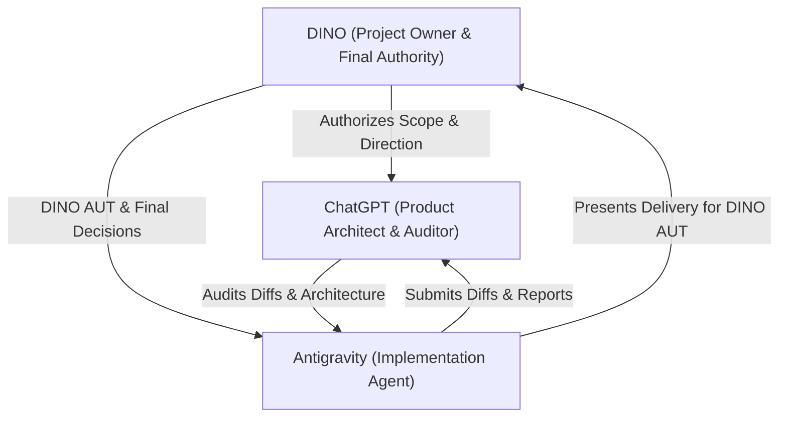
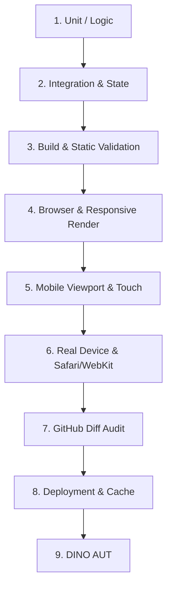

# DINO DEVELOPMENT GOVERNANCE

> **Status:** PERMANENT & MANDATORY  
> **Applies to:** All development agents (Antigravity), AI reviewers (ChatGPT), engineers, and contributors.

---

## 1. The DINO Development Lifecycle

All work on the DINO codebase must follow the sequential 9-stage lifecycle:


1. **DISCOVER:** Inspect active repository state, active files, Git branch/HEAD, and user context. Identify dependencies, constraints, and baseline behavior.
2. **SPEC:** Formulate a formal Change Set specification detailing objective, source of truth, allowed files, protected areas, data impact, and test requirements.
3. **AUTHORIZE:** Obtain explicit authorization from DINO (or Product Architect within delegated authority) before making modifications.
4. **IMPLEMENT:** Apply minimal, clean, targeted changes strictly within authorized file boundaries.
5. **TEST:** Execute automated logic tests, build validation, and manual scenario runs.
6. **GITHUB AUDIT:** Inspect `git diff`, `git status`, and `git diff --check`. Commit with standard semantic messages and push to the authorized branch. AI Auditor reviews raw Git diff.
7. **VERIFY:** Perform browser, mobile viewport, and PWA behavior checks. Mark items `BLOCKED` or `NOT VERIFIED` if live environment testing is unavailable.
8. **DEPLOY:** Verify production or preview deployment on Vercel, confirming asset caching, service worker cache busting, and deployment SHA.
9. **LOCK:** Present the final Change Set Report for DINO AUT. Upon approval, record completion in session state and lock the baseline.

---

## 2. Explicit State Definitions

DINO governance enforces strict, decoupled state tracking. **States must never be inferred or conflated.**

| State | Definition | Invariant / Anti-Assumption Rule |
| :--- | :--- | :--- |
| `PROPOSED` | Change Set formulated and submitted for review. | Does not authorize implementation. |
| `AUTHORIZED` | Scope explicitly approved by DINO / Architect. | Implementation has not yet commenced. |
| `IMPLEMENTING` | Active code changes in progress. | Code is volatile and unverified. |
| `IMPLEMENTED` | Code edits complete in local workspace. | `IMPLEMENTED` $\neq$ `VERIFIED`. |
| `AUTO_VERIFIED` | Automated scripts / tests pass without errors. | `AUTO_VERIFIED` $\neq$ `VISUALLY_VERIFIED` or `PRODUCT PASS`. |
| `GITHUB_AUDITED` | Git diff independently inspected; no unauthorized edits. | Diff approved, but deployment unverified. |
| `VISUALLY_VERIFIED` | Rendered UI, layout, and animations verified in browser. | Visual correctness $\neq$ Real-device Safari/PWA correctness. |
| `DINO_AUT_PENDING` | The implementation is ready for hands-on acceptance testing by DINO. | DINO AUT has not yet occurred. |
| `DINO_AUT_APPROVED` | DINO has explicitly accepted the product result through hands-on testing. | DINO AUT approval does not mean GitHub Audit is complete. |
| `COMMITTED` | Changes recorded to local Git history. | Local commit $\neq$ Remote synchronization. |
| `PUSHED` | Commits transferred to remote GitHub repository. | `PUSHED` $\neq$ `DEPLOYED`. |
| `DEPLOYED` | Live build generated and served on Vercel. | `DEPLOYED` $\neq$ `DINO_AUT_APPROVED` or Cache-Invalidated. |
| `LOCKED` | Task closed, baseline updated, session state finalized. | Invariant baseline for subsequent tasks. |

> **Note on DINO AUT & GitHub Audit:**
> DINO AUT approval does NOT mean GitHub Audit is complete. GitHub Audit and DINO AUT remain independent gates. DINO is the final authority for product direction and scope.

---

## 3. The Change Set System

Every discrete unit of work must operate within a structured **Change Set**.

### A. Required Change Set Fields
- **ID:** Unique identifier (e.g., `DINO-000`, `DINO-001`).
- **Objective:** Concise summary of the task.
- **Current State:** Active governance state.
- **Source of Truth:** Applicable authority level (P0–P6).
- **Authorized Scope:** Specific features, logic, or docs to add/update.
- **Protected Areas:** Modules, files, or logic strictly off-limits.
- **Allowed Files:** Exact list of files permitted to be edited/created.
- **Files Intentionally Not Changed:** Explicit list of untouched dependencies.
- **Data-Model Impact:** Schema, localStorage, or state mutations.
- **UX Impact:** Changes to user flow, styling, interaction, or ergonomics.
- **Edge Cases & Failure Modes:** Specific boundaries, empty states, or error cases.
- **Acceptance Criteria:** Unambiguous conditions required for sign-off.
- **Regression Tests:** Checks ensuring existing functionality is unbroken.
- **Stop Conditions:** Specific triggers that require immediate work halt.

### B. Grouping & Scope Rules
- **Related Changes:** Logical sub-tasks belonging to a single coherent feature or fix may be grouped to minimize inspection overhead.
- **No Scope Bloat:** Unrelated features, refactoring whims, or stylistic rewrites must never be bundled together.

---

## 4. Roles & Boundaries



### A. Antigravity (Implementation Agent)
- **Role:** Autonomous engineering implementer.
- **Allowed Actions:**
  - Read-only workspace and Git inspection.
  - Proposing implementation architecture and technical specs.
  - Writing code, styles, scripts, and documentation within authorized scope.
  - Running automated tests and syntax/lint checks.
  - Identifying technical risks, edge cases, and architectural friction.
- **Forbidden Actions:**
  - Silently changing product direction, UI layout, or business rules.
  - Introducing new frameworks (React, Vue, Vite, Tailwind, etc.).
  - Creating parallel applications or "V2" rewrites.
  - Deleting or degrading existing functionality.
  - Injecting mock data into operational user workflows.
  - Expanding task scope without approval.
- **Rule:** If ambiguity or technical blockers arise: **STOP → REPORT → ASK DINO.**

### B. ChatGPT (Product Architect & AI Auditor)
- **Role:** Product architect, QA reviewer, and independent auditor.
- **Responsibilities:**
  - Validates requirements against P0 DINO Project Owner decisions and P1 Constitution.
  - Audits raw Git diffs and file trees directly from repository history.
  - Reviews data flows, state mutations, and training science logic.
  - Detects unauthorized edits, hidden feature removals, or architectural drift.
  - **Rule:** Never trust agent completion summaries without raw diff verification.

### C. DINO (Project Owner & Product Owner)
- **Role:** Project Owner, Product Owner, and Final Decision Authority.
- **Exclusive Authority:**
  - Approves scope, product direction, UX decisions, architecture decisions, and Change Sets.
  - Directional product pivot or expansion.
  - UX paradigm changes.
  - Scope modifications.
  - Architectural or dependency alterations.
  - Hands-on product acceptance testing (DINO AUT) and production release authorization.
- **Rule:** Silence is **never** consent. DINO approval must be explicit.

---

## 5. GitHub & Version Control Rules

1. **Clean Workspace:** Verify clean status before starting (`git status --short`).
2. **Branch Discipline:** Work only on designated feature/fix branches or authorized branch workflows.
3. **Atomic Scope:** Touch only authorized files. Never commit unrelated IDE, OS, or scratch files.
4. **Sanity Check:** Before committing, always run:
   ```bash
   git diff
   git status --short
   git diff --check
   ```
5. **Descriptive Commits:** Use standard semantic commit messages (e.g., `feat:`, `fix:`, `docs:`, `chore:`).
6. **Push & Traceability:** Push to remote repository and report exact commit SHA and branch name.

---

## 6. Vercel & Deployment Rules

1. **Static Architecture Awareness:** DINO utilizes static deployment (`@vercel/static` in `vercel.json`) with fine-grained caching headers.
2. **Deployment Gate:** Do not assume "Git push = Live user update." Verify actual deployment generation, build logs, and status.
3. **Cache Invalidation:**
   - Static assets (`/css/*`, `/js/*`) are cached for 24 hours (`max-age=86400`).
   - Core root files (`/sw.js`, `/manifest.json`) are set to `no-cache, no-store, must-revalidate`.
   - When updating JS/CSS, update cache bust keys or service worker versioning if necessary to ensure users receive fresh assets.
4. **Unverifiable State:** If live deployment cannot be programmatically verified from the current environment, explicitly report: `DEPLOYMENT STATUS: NOT VERIFIED / UNVERIFIABLE FROM ENVIRONMENT`.

---

## 7. Service Worker & Cache Safety

1. **PWA Preservation:** DINO is an offline-capable Progressive Web App. Do not disable or break service worker registration, offline caching, or background sync.
2. **Redirection Sanitization:** Preserve iOS Safari WebKit redirect fixes (`sanitizeResponse`) in `sw.js`.
3. **Cache Versioning:** Any structural change to cached files requires careful consideration of `CACHE_NAME` in `sw.js`.
4. **Isolation:** Service worker or caching strategy redesigns must be handled as dedicated, isolated Change Sets.

---

## 8. Data & Program Integrity

1. **Real Data Invariant:** User workout history, personal records, calendar entries, volume statistics, and AI context must reflect authentic user activity.
2. **No Mocking in Production:** Never inject fake workouts or placeholder PRs to simulate a populated UI.
3. **Honest Empty States:** Unpopulated views must render clear, motivational, and instruction-rich empty states.
4. **BFS Program Fidelity:** The BFS Hybrid Athlete 2-Week Rotation is an authorized preset. Its exercise selection, progression logic, set/rep ranges, and notes must remain 100% faithful to the source document (`BFS_Hybrid_Athlete_2_Week_Rotation.docx`).

---

## 9. Mobile-First UX Principles

1. **Ergonomic Thumb Zones:** Primary workout actions (logging sets, starting timers, completing exercises) must be easily reachable with one hand.
2. **Zero Friction:** Minimize taps, unnecessary modal prompts, and keyboard switching during active workout logging.
3. **High Contrast & Legibility:** Ensure workout metrics, rest timers, and exercise cues are instantly readable in bright gym or outdoor sunlight environments.
4. **Non-Destructive UI Changes:** Visual styling refinements must never remove existing interactive capabilities.

---

## 10. Multi-Tier QA Requirements

Every Change Set must specify and verify testing across applicable tiers:



- If a specific tier cannot be executed (e.g., physical device testing), explicitly document it as `BLOCKED` or `NOT VERIFIED`.

---

## 11. Audit Requirements & Discrepancy Detection

Before finalizing any task, the agent and auditor must verify:
- [ ] Requirement matches implementation.
- [ ] Implementation matches actual data flow.
- [ ] UI behavior is consistent across screens.
- [ ] Automated tests pass.
- [ ] Git diff contains zero unauthorized modifications.
- [ ] Protected areas remain completely untouched.
- [ ] No fake data, hard-coded stubs, or console spam were introduced.
- [ ] Service worker and offline caches are uncompromised.

---

## 12. Stop Conditions & Escalation Protocol

**HALT WORK IMMEDIATELY** if any of the following occur:
- Base branch or repository state is uncertain.
- Uncommitted, untracked changes of unknown origin exist in the workspace.
- The task requirements contradict the Product Constitution.
- An architectural rewrite or framework migration appears necessary.
- Changes could cause irreversible loss or corruption of real user data.
- An unexpected large diff or ripple effect is triggered in unrelated files.

### Escalation Template
```markdown
==================================================
STATUS: BLOCKED
==================================================
CHANGE SET: [ID]
REASON: [Clear, unambiguous explanation of why work is stopped]
EVIDENCE: [Relevant command output, code snippet, or conflicting requirement]
DECISION REQUIRED: [Specific questions or proposals submitted to DINO / Product Architect]
==================================================
```

---

## 13. Final Change Set Report Template

Upon completing any task, provide the standardized report:

```markdown
==================================================
DINO CHANGE SET REPORT
==================================================
1. Objective:
2. Authorized scope:
3. Implemented:
4. Files changed:
5. Files intentionally not changed:
6. Data-model impact:
7. Tests run:
8. Browser/mobile verification:
9. GitHub branch:
10. Commit SHA:
11. Push status:
12. Vercel/deployment status:
13. Unauthorized changes: (None)
14. Known limitations:
15. Remaining blockers:
16. Recommended next step:
==================================================
```

---

## 14. The Prime Directive

```
╔════════════════════════════════════════════════════════════════════╗
║                       THE PRIME DIRECTIVE                          ║
║                                                                    ║
║  1. PRESERVE THE EXISTING DINO.                                    ║
║  2. IMPROVE IT INCREMENTALLY.                                      ║
║  3. DO NOT REPLACE IT.                                             ║
║  4. DO NOT CREATE DINO V2.                                         ║
║  5. DO NOT SILENTLY CHANGE THE PRODUCT OR ARCHITECTURE.            ║
║  6. DO NOT SILENTLY INVENT REQUIREMENTS OR REMOVE FEATURES.        ║
║                                                                    ║
║  WHEN IN DOUBT: STOP → REPORT → ASK.                               ║
╚════════════════════════════════════════════════════════════════════╝
```
