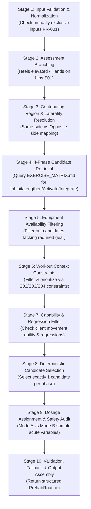

# DINO-005B — STEP 05 DETERMINISTIC PREHAB ENGINE DESIGN

> **Change Set:** DINO-005B — Prehab / Corrective Engine
> **Step:** 05 — Deterministic Prehab Engine Design
> **Status:** SPECIFICATION / ARCHITECTURAL DESIGN COMPLETE (DOCUMENTATION ONLY)
> **Authority:** DINO (Project Owner / Founder)
> **Implementer:** Antigravity (Implementation Agent)
> **Branch:** `feature/dino-005b-step05-engine-design`
> **Baseline Commit:** `d7c8940a0b075b524028b38cb044fb273763a24f`

---

## 1. Operating Principles & Strict Source Boundaries

1. **NO APPLICATION CODE AUTHORIZED:** Zero application files (`js/*`, `css/*`, `index.html`, `package.json`, `sw.js`, `vercel.json`, `manifest.json`) are modified. DINO-005A remains locked.
2. **STRICT CITATION DISCIPLINE (NO MASKED ASSUMPTIONS):**
   - Direct source facts are labeled `[LOCKED-SOURCE]`.
   - Product requirements from S05 (`Kế-hoạch-cơ-bản.txt`) are labeled `[PRODUCT-RULE]`.
   - Algorithmic tie-breakers, candidate weights, and heuristic structures proposed by engineering are explicitly labeled `[ENGINEERING-PROPOSAL]`.
   - Design trade-offs requiring DINO / Project Owner sign-off are labeled `[NEEDS-ADMIN-DECISION]`.
   - Areas where literature does not specify a rule are labeled `[SOURCE-GAP]`.
   - **Never present an engineering choice or heuristic number as a NASM or NSCA scientific fact.**
3. **AI COACH BOUNDARY:**
   - The DINO AI Coach is **completely outside** this engine.
   - The Prehab Engine is a 100% deterministic, state-machine/lookup pipeline operating as an **$O(N)$ bounded deterministic catalog evaluation, where $N = 37$ in the current catalog** (sub-2ms execution bounds, zero unbounded scaling).
   - External LLMs do not generate, alter, or compute prehab routines.
4. **ASSESSMENT-FIRST, NOT DIRECT SHORTCUTS:**
   - An observed movement compensation (e.g., knee valgus) does not map directly to one universal routine. It triggers an assessment branch to distinguish contributing anatomical drivers (e.g., foot/ankle restricted dorsiflexion vs. hip/LPHC gluteal weakness).
5. **ZERO EXERCISE INVENTION:**
   - The engine may only draw from verified source candidates (`EXERCISE_MATRIX.md`). If data is missing or incompatible, the engine must return an explicit status of insufficient supported data or an authorized safe fallback, never an invented exercise.

---

## 2. Source Hierarchy & Roles in Step 05

| Source ID | Source Title | Formal Role in Engine Design | Authority Boundary |
| :--- | :--- | :--- | :--- |
| **S01** | **NASM Essentials of Corrective Exercise Training** | **Primary Corrective Authority** | Governs the 4-phase continuum (Inhibit $\rightarrow$ Lengthen $\rightarrow$ Activate $\rightarrow$ Integrate), movement impairment identification, kinetic chain checkpoints, muscle overactivity/underactivity pairings, laterality, and candidate exercise sets. |
| **S02** | **NASM Essentials of Sports Performance Training** | **Athletic Context Constraint** | Governs movement prep sequencing, non-fatiguing active warm-up principles, dynamic stretching, and athletic context constraints. Does NOT dictate exact mathematical multipliers. |
| **S03** | **NSCA Essentials of Strength & Conditioning (4th Ed.)** | **Load & Recovery Constraint** | Governs training-stress modulation, exercise sequencing, static stretching duration caps ($\le 30$s pre-lifting), and fatigue management. Does NOT dictate DINO-specific routine generation. |
| **S04** | **BFS Hybrid Athlete 2-Week Rotation** | **Operational Training Context** | Governs training session types (Full Body, Upper, Lower, Quality Run, Easy Run, Long Run, Soccer, Rest), hybrid scheduling demands, and muscle-overlap avoidance. |
| **S05** | **Kế-hoạch-cơ-bản.txt** (Reconciled Governance Record) | **Product & UX Requirements** | Physical file not available on local filesystem; substantive product rules PR-001 to PR-004 reconciled under Founder authority. Governs user workflow: mutually exclusive radio-button behavior (PR-001), workout-type dependency (PR-002), client determinism (PR-003), and dual dosing modes (PR-004). Possesses ZERO clinical authority. |

### 2.1 Conceptual Framework Distinction: NASM CEx vs. NSCA RAMP (P2-02)

- **NASM Corrective Exercise Continuum (S01):** Targeted neuromyofascial restoration (`Inhibit` $\to$ `Lengthen` $\to$ `Activate` $\to$ `Integrate`) addressing specific static and dynamic movement compensations.
- **NSCA RAMP Warm-Up (S03 Ch. 14):** Systemic athletic preparation framework (`Raise` $\to$ `Activate & Mobilize` $\to$ `Potentiate`).
- **Integration Boundary:** Mode A prehab slots into the *Activate & Mobilize* component of a workout warm-up prior to specific resistance warm-up sets (which satisfy *Potentiate*). NASM CEx and NSCA RAMP are complementary, but they are NOT interchangeable frameworks.

---

## 3. Input Contract (`AssessmentInput`)

The engine consumes a strictly typed, immutable input object:

```typescript
interface AssessmentInput {
  // 1. Observed Finding / Selected Deviation
  primaryFinding: string;               // e.g. "knees_move_inward", "low_back_arches", "feet_turn_out"
  secondaryFindings?: string[];         // Optional additional observed compensations

  // 2. Anatomical Region & Checkpoint
  region: "foot_ankle" | "knee" | "lphc" | "shoulder" | "cervical_spine";

  // 3. Laterality (Side-specific asymmetry)
  laterality: "bilateral" | "left" | "right" | "unspecified";

  // 4. Assessment Branch Result (Sub-test / Modification findings)
  assessmentBranch?: {
    testType: "heels_elevated" | "hands_on_hips" | "none";
    findingModifies: boolean;          // true = compensation corrected by heel lift; false = persisted
  };

  // 5. Capability / Regression State
  capabilityState: {
    canPerformBalanceDrills: boolean;  // Single-leg balance reach vs. two-leg regression
    overheadMobilityRestricted: boolean;// Cannot do overhead reach without arching
    matFloorAvailable: boolean;        // Able to lie prone/supine on floor
  };

  // 6. Workout / Session Context (Derived from BFS schedule or user selection)
  workoutContext: "lower" | "upper" | "full_body" | "quality_run" | "easy_run" | "soccer" | "offday";

  // 7. Available Equipment
  availableEquipment: Array<"bodyweight" | "foam_roller" | "lacrosse_ball" | "mini_band" | "dumbbell" | "mat" | "wall" | "bench">;

  // 8. Session Mode
  sessionMode: "pre_workout" | "off_day";
}
```

---

## 4. Deterministic Pipeline Architecture

The Prehab Engine executes as a pure, stateless function with 10 deterministic stages:

$$\text{generatePrehabRoutine}(\text{input: AssessmentInput}) \longrightarrow \text{PrehabRoutine}$$



### Stage 1: Input Validation & Normalization
- Enforce mutual exclusivity rules (`[PRODUCT-RULE]` PR-001):
  - If both `low_back_arches` (APT) and `low_back_rounds` (PPT) are present, retain only the user's primary selection or flag `CONFLICTING_INPUT`.
  - If both `knees_move_inward` (Valgus) and `knees_move_outward` (Varus) are present, enforce mutual exclusion.
- Validate that `region`, `sessionMode`, and `workoutContext` contain valid enum values.

### Stage 2: Assessment Branching (`[LOCKED-SOURCE]` S01 Ch. 5, 12, 13)
- An observed compensation does not immediately trigger a single universal routine.
- *Heels-Elevated Branch for Knee Valgus / Forward Lean:*
  - If Overhead Squat shows `knees_move_inward` or `excessive_forward_lean`:
    - If `heels_elevated.findingModifies == true` (compensation disappears when heels are lifted): **Lower leg / Foot & Ankle** is primary driver (restricted ankle dorsiflexion / tight gastrocnemius/soleus).
    - If `heels_elevated.findingModifies == false` (compensation persists despite heel lift): **LPHC / Hip** is primary driver (underactive gluteus medius/maximus, tight adductors/TFL).
- *Hands-on-Hips Branch for Arms Fall Forward:*
  - If hands on hips eliminates forward torso lean or arch, latissimus dorsi / pectoral complex is primary driver; if it persists, core/lumbar stabilizers are implicated.

### Stage 3: Contributing Region & Laterality Resolution (`[LOCKED-SOURCE]` S01 Ch. 14)
- **Bilateral Impairment:** Prescribes bilateral or alternating execution.
- **Asymmetric Impairment (e.g., Asymmetric Weight Shift AWS):**
  - Laterality is first-class operational data.
  - S01 establishes explicit unilateral cross-body patterns:
    - Same-side (shifted side): Adductor complex, TFL/IT band (`AWS-INH-01`, `AWS-LEN-01`), Gluteus medius (`AWS-ACT-01`).
    - Opposite-side (unweighted side): Piriformis (`AWS-INH-03`, `AWS-LEN-05`), Biceps femoris (`AWS-INH-04`, `AWS-LEN-04`), Adductor complex (`AWS-ACT-02`).
  - **Rule:** The engine must never collapse asymmetric findings into generic bilateral routines.

### Stage 4: 4-Phase Candidate Retrieval (`[LOCKED-SOURCE]` S01 Ch. 8–11)
- Query all candidate exercises from `EXERCISE_MATRIX.md` matching the resolved target impairment across the four discrete phases:
  - **Phase 1: Inhibit** (Self-Myofascial Release — SMR)
  - **Phase 2: Lengthen** (Static or Neuromuscular Stretching)
  - **Phase 3: Activate** (Isolated Strengthening or Positional Isometrics)
  - **Phase 4: Integrate** (Integrated Dynamic Movement)

### Stage 5: Equipment Availability Filtering (`[ENGINEERING-PROPOSAL]`)
- Match required equipment of candidates against `availableEquipment`.
- If a candidate requires a `foam_roller` and the user only has `bodyweight`, check for a bodyweight substitute or regression.
- If no valid candidate in that phase can be performed with available equipment, trigger the fallback mechanism (Stage 10).

### Stage 6: Workout Context Constraints (`[LOCKED-SOURCE]` S02, S03, S04)
- Apply training context boundaries:
  - *Context Upper (`upper`):* Phase 4 Integrate should reinforce scapular/thoracic stabilization or overhead linkage (`SE-INT-01`, `FH-INT-01`) rather than heavy lower limb loading.
  - *Context Lower (`lower`):* Phase 4 Integrate must avoid premature eccentric fatigue; prioritize balance and multiplanar activation (`KV-INT-01`, `FA-INT-01`, `EFL-INT-01`).
  - *Context Running (`quality_run`, `easy_run`):* S02/S03 rule: Prioritize dynamic ankle stiffness, hip extension, and balance (`FA-INT-01`, `FA-INT-03`); static stretches held $\le 30$ seconds.
  - *Context Soccer (`soccer`):* Prioritize groin/adductor resilience and frontal plane stability (`KV-INT-01`, `AWS-INT-01`).
- *Note:* Context provides constraint and suitability filtering; exact mathematical multipliers are **NOT** source-derived and remain an `[ENGINEERING-PROPOSAL]` (see Section 6).

### Stage 7: Capability & Regression Filter (`[LOCKED-SOURCE]` S01 Ch. 11, 12)
- S01 establishes an integration progression:
  $$\text{Floor / Wall-Supported (Ball Squat)} \longrightarrow \text{Step-Up to Balance} \longrightarrow \text{Lunge to Balance} \longrightarrow \text{Single-Leg Squat}$$
- If `capabilityState.canPerformBalanceDrills == false`, single-leg squats or high-demand balance drills (`FA-INT-04`, `KV-INT-01`) must regress to supported two-leg drills (`Ball Squat`, `Two-Leg Balance Reach`).

### Stage 8: Deterministic Candidate Selection
- Select exactly one candidate per phase: $[P_1, P_2, P_3, P_4]$.
- If multiple candidates survive filtering, tie-breaking follows a strict deterministic precedence (Section 6).

### Stage 9: Dosage Assignment & Safety Audit (`[LOCKED-SOURCE]` S01, S03)
- Assign sample acute variables based on `sessionMode`:
  - **Mode A (Pre-Workout):** Strictly non-fatiguing active preparation.
    - SMR: 1 set, hold trigger point 30–60s.
    - Lengthen: 1 set, static hold 20–30s ($\le 30$s cap per S03 Ch. 14 to preserve power output).
    - Activate: 1 set, 10–15 reps, 2s isometric hold at contraction, 4/2/1 tempo.
    - Integrate: 1 set, 10–15 reps, slow controlled tempo.
  - **Mode B (Off-Day / Extended Corrective):** Deeper restoration.
    - SMR: 1–2 sets, 60–90s.
    - Lengthen: 2–3 sets, 30–60s.
    - Activate: 2–3 sets, 12–15 reps.
    - Integrate: 2–3 sets, 10–15 reps.
- *Strict Rule:* These dosage values represent source-supported sample acute variables; final product dosage pinning remains a `[PRODUCT-RULE]` / `[NEEDS-ADMIN-DECISION]`.

### Stage 10: Validation, Fallback & Output Assembly
- Validate that all 4 phases are populated with source-verified exercises.
- If any phase lacks a valid exercise: invoke Section 12 Fallback.
- Assemble and return the immutable `PrehabRoutine` record.

---

## 5. Laterality: Preserving Asymmetrical Movement Relationships

S01 Chapter 14 explicitly treats Asymmetric Weight Shift (`imp-lphc-asymmetric-shift`) as a multi-planar, cross-body compensation. The engine must preserve these exact laterality relationships:

| Kinetic Chain Segment | Muscle / Functional Unit | Functional Role | Prescribed Action | Canonical Candidate (Legacy Ref) |
| :--- | :--- | :--- | :--- | :--- |
| **Shifted Side (Same-Side)** | Adductor complex | Overactive | Inhibit (SMR) & Lengthen | `cex-inh-03` (`AWS-INH-01`), `cex-len-03` (`AWS-LEN-01`) |
| **Shifted Side (Same-Side)** | TFL / IT band | Overactive | Inhibit (SMR) | `cex-inh-04` (`AWS-INH-02`) |
| **Shifted Side (Same-Side)** | Gluteus medius | Underactive | Activate (Isolated) | `cex-act-02` (`AWS-ACT-01`) |
| **Unweighted Side (Opposite-Side)** | Piriformis | Overactive | Inhibit (SMR) | `cex-inh-07` (`AWS-INH-03`) |
| **Unweighted Side (Opposite-Side)** | Biceps femoris (short head) | Overactive | Inhibit (SMR) & Lengthen | `cex-inh-06` (`AWS-INH-04`), `cex-len-06` (`AWS-LEN-04`) |
| **Unweighted Side (Opposite-Side)** | Gastrocnemius / Soleus | Overactive | Lengthen | `cex-len-01` (`AWS-LEN-03`) |
| **Unweighted Side (Opposite-Side)** | Adductor complex | Underactive | Activate (Isolated) | `cex-act-03` (`AWS-ACT-02`) |

> **Invariant:** The Prehab Engine will reject any configuration that flattens `AWS` into bilateral foam rolling or identical bilateral activation. Laterality must explicitly govern which side receives inhibition versus activation.

---

## 6. Candidate Selection & Scoring Classification

When multiple candidate exercises in `EXERCISE_MATRIX.md` qualify for a single phase, the engine resolves ties using deterministic priority scoring.

> [!CAUTION]
> **CLASSIFICATION MANDATE & GOVERNANCE NOTICE (P1-02):**
> All scoring numbers, context multipliers ($1.0–3.5$), base weights ($+100$), and tie-breaker algorithms are **`[ENGINEERING-PROPOSAL]`**. They are deterministic engineering heuristics created for product ranking and reproducibility. They are NOT clinical scoring values derived directly from NASM, NSCA, or another scientific source.

### 6.1 Proposed Deterministic Tie-Breaker Precedence (`[ENGINEERING-PROPOSAL]`)
When multiple exercises in `EXERCISE_MATRIX.md` match an impairment and phase:
1. **Equipment Match Score:** Minimal equipment (`bodyweight` > `mini_band` > `foam_roller` > `dumbbell`).
2. **Context Specificity:** Exercise listed in source chapter specifically matching the target context (e.g. S02 agility/running drills prioritized before running sessions).
3. **Lexicographical Catalog Order:** If scores are identical, select candidate with lower canonical catalog ID (e.g. `cex-inh-01` over `cex-inh-02`).

### 6.2 Context Constraint Compatibility Matrix (`[ENGINEERING-PROPOSAL]` / `[NEEDS-ADMIN-DECISION]`)

| Impairment Focus | `lower` | `upper` | `full_body` | `quality_run` | `easy_run` | `soccer` | `offday` |
| :--- | :---: | :---: | :---: | :---: | :---: | :---: | :---: |
| **Foot / Ankle (`FA`)** | HIGH | LOW | MEDIUM | **MAX** | HIGH | **MAX** | HIGH |
| **Knee Valgus (`KV`)** | **MAX** | LOW | HIGH | MEDIUM | MEDIUM | **MAX** | HIGH |
| **LPHC — Low Back Arches / APT** | **MAX** | MEDIUM | **MAX** | HIGH | HIGH | HIGH | **MAX** |
| **LPHC — Low Back Rounds / PPT** | **MAX** | LOW | HIGH | MEDIUM | MEDIUM | MEDIUM | **MAX** |
| **LPHC — Forward Lean (`EFL`)** | **MAX** | LOW | HIGH | HIGH | HIGH | MEDIUM | HIGH |
| **LPHC — Asymmetric Shift (`AWS`)**| **MAX** | LOW | HIGH | MEDIUM | MEDIUM | HIGH | **MAX** |
| **Shoulder Elevation (`SE`)** | LOW | **MAX** | HIGH | LOW | LOW | LOW | HIGH |
| **Scapular Winging (`SW`)** | LOW | **MAX** | HIGH | LOW | LOW | LOW | HIGH |
| **Forward Head (`FH`)** | LOW | **MAX** | MEDIUM | LOW | LOW | LOW | **MAX** |

*Key:*
- `MAX`: Primary focus; routine selection directly mirrors this impairment.
- `HIGH` / `MEDIUM`: Compatible; routine incorporates drills if selected by user.
- `LOW`: Constrained; Phase 4 Integration will adjust to match the day's primary kinetic demand (e.g. upper body impairment on leg day integrates via lower body stability drill).

---

## 7. Dosage Management: Source Samples vs. DINO Decisions

To prevent conflating textbook sample programs with DINO product policy, acute variables are split into two discrete tiers:

```
┌────────────────────────────────────────────────────────┐
│ TIER A: SOURCE-SUPPORTED SAMPLE ACUTE VARIABLES        │
│ (NASM S01 Ch. 8–11; NSCA S03 Ch. 14)                   │
├────────────────────────────────────────────────────────┤
│ • SMR: 1 set, hold tender spots 30–90 seconds          │
│ • Static Stretch: 1–2 sets, hold 30 seconds            │
│ • Pre-Lifting Static Stretch Cap: ≤ 30s (NSCA Ch. 14)  │
│ • Isolated Activation: 1–2 sets, 10–15 reps, 4/2/1     │
│ • Integration: 1–2 sets, 10–15 reps, controlled        │
└────────────────────────────────────────────────────────┘
                           │
                           ▼ Adapted deterministically via
┌────────────────────────────────────────────────────────┐
│ TIER B: DINO OPERATIONAL DOSING PROFILES               │
│ [PRODUCT-RULE / NEEDS-ADMIN-DECISION]                  │
├────────────────────────────────────────────────────────┤
│ Mode A (Pre-Workout Prehab):                           │
│ • Exactly 1 set per phase (4 exercises total)          │
│ • P1 Inhibit: 30–45s | P2 Lengthen: 20–25s (capped)   │
│ • P3 Activate: 10–12 reps | P4 Integrate: 8–10 reps    │
│ • Total Duration: 3–6 minutes | ZERO FATIGUE           │
├────────────────────────────────────────────────────────┤
│ Mode B (Off-Day / Extended Corrective):                │
│ • 2–3 sets per phase                                   │
│ • P1 Inhibit: 60s | P2 Lengthen: 30–45s                │
│ • P3 Activate: 12–15 reps | P4 Integrate: 10–12 reps   │
│ • Total Duration: 12–20 minutes | TISSUE RESTORATION   │
└────────────────────────────────────────────────────────┘
```

---

## 8. Safety & Clinical Invariants

1. **No Medical Diagnosis:** DINO explicitly informs users that movement screening and prehab routines are training optimization tools, not medical, physical therapy, or orthopedic diagnoses.
2. **Pain & Red-Flag Boundaries (`[SOURCE-GAP]` / `[NEEDS-ADMIN-DECISION]`):**
   - If a user reports sharp, shooting, or acute pain, the engine must return a non-exercise safety notice (`STATUS: CLINICAL_RED_FLAG`).
   - S01 contraindications for SMR: acute inflammation, deep vein thrombosis, open wounds, osteoporosis.
   - S01 contraindications for stretching: acute muscle strain, fractured bone, acute joint instability.
3. **Unsupported Assessment Input:** If an input cannot be mapped to verified S01/S02 literature, the engine outputs `INSUFFICIENT_SUPPORTED_DATA` rather than hallucinating a routine.
4. **Capability Failure Handling:** When a user indicates inability to perform an integration drill, the engine deterministically regresses to a supported, floor-based or two-leg alternative (`[LOCKED-SOURCE]` S01 Ch. 11).

---

## 9. Output Contract (`PrehabRoutine`)

The engine returns an immutable, serializable `PrehabRoutine` object:

```typescript
interface PrehabRoutine {
  routineId: string;                    // UUID or deterministic hash
  timestamp: string;                    // ISO timestamp
  status: "COMPLETE" | "PARTIAL" | "FALLBACK_APPLIED" | "INSUFFICIENT_SUPPORTED_DATA" | "SAFETY_DIVERTED";

  // Snapshot of Ingested Assessment
  assessmentSnapshot: {
    primaryFinding: string;
    resolvedRegion: string;
    resolvedLaterality: "bilateral" | "left" | "right" | "unspecified";
    assessmentBranchUsed: string | null;
  };

  // Operational Context
  context: {
    workoutContext: string;
    sessionMode: "pre_workout" | "off_day";
    equipmentFiltered: boolean;
  };

  // The 4-Phase Prescribed Exercises
  phases: {
    phase1_inhibit: PrescribedExerciseRecord;
    phase2_lengthen: PrescribedExerciseRecord;
    phase3_activate: PrescribedExerciseRecord;
    phase4_integrate: PrescribedExerciseRecord;
  };

  // Safety & Provenance Metadata
  safetyAudit: {
    painReported: boolean;
    redFlagTriggered: boolean;
    cautions: string[];
  };

  traceability: {
    appliedRuleIds: string[];           // e.g. ["RULE-ASM-01", "RULE-OAU-04", "PR-001"]
    sourceIds: Array<"S01" | "S02" | "S03" | "S04" | "S05">;
  };
}

interface PrescribedExerciseRecord {
  candidateId: string;                  // e.g. "KV-INH-02", "FA-ACT-01"
  name: string;                         // Standard English / anatomical name
  phase: "inhibit" | "lengthen" | "activate" | "integrate";
  targetMuscle: string;
  laterality: "bilateral" | "same_side" | "opposite_side";
  equipment: string[];
  dosage: {
    sets: number;
    reps: number | null;
    holdSeconds: number | null;
    tempo: string;
    dosageStatus: "SOURCE_SAMPLE" | "DINO_OPERATIONAL_DECISION";
  };
  regressionAlternative?: string;
  progressionAlternative?: string;
  sourceCitation: string;
}
```

---

## 10. Comprehensive Engine Decision Table

The decision table below specifies the engine's behavior under all operational conditions:

| Case # | Operational Condition | Trigger / Input State | Deterministic Engine Action | Resulting Routine Status | Authority Classification |
| :---: | :--- | :--- | :--- | :--- | :--- |
| **01** | **Standard Known Impairment** | Single recognized finding (e.g. `knees_move_inward`) with complete data | Execute Stages 1–10; select 4-phase tuple from `EXERCISE_MATRIX.md` | `COMPLETE` | `[LOCKED-SOURCE]` S01 |
| **02** | **Assessment Branch Active** | Finding has sub-test (e.g. `heels_elevated`) | Branch logic directs candidate retrieval to Foot/Ankle or LPHC | `COMPLETE` | `[LOCKED-SOURCE]` S01 |
| **03** | **Unknown / Unmapped Finding**| Impairment string not found in S01 catalog | Halt candidate retrieval; do NOT invent exercises; return insufficient data notice | `INSUFFICIENT_SUPPORTED_DATA` | `[LOCKED-SOURCE]` / S-GAP |
| **04** | **Missing Laterality on AWS** | Asymmetric weight shift selected but `laterality == "unspecified"` | Prompt user for shifted side; if forced, apply bilateral safe SMR/stretch with disclaimer | `PARTIAL` | `[ENGINEERING-PROPOSAL]` |
| **05** | **Unavailable Equipment** | Required gear (e.g. foam roller) absent in `availableEquipment` | Substitute verified source-compatible alternative (e.g. tennis ball or active stretch) | `FALLBACK_APPLIED` | `[ENGINEERING-PROPOSAL]` |
| **06** | **Capability Failure** | User flags inability to perform single-leg balance / complex integration drill | Regress Phase 4 drill to two-leg or wall-supported alternative from matrix | `COMPLETE` | `[LOCKED-SOURCE]` S01 Ch. 11 |
| **07** | **Conflicting Deviations** | Opposing findings present (e.g. both APT and PPT selected) | Enforce PR-001 mutual exclusivity; prioritize primary selection, discard conflicting | `COMPLETE` (with warning) | `[PRODUCT-RULE]` PR-001 |
| **08** | **Missing Session Context** | `workoutContext` is null/empty | Default to `full_body` general athletic maintenance constraints | `COMPLETE` | `[ENGINEERING-PROPOSAL]` |
| **09** | **Source Gap on Phase** | Specific phase lacks source-verified exercise for that impairment | Apply authorized product fallback; never invent an unverified exercise | `FALLBACK_APPLIED` | `[SOURCE-GAP]` / S-DEC |
| **10** | **Acute Pain / Red Flag** | User declares acute joint pain or red flag symptom | Divert away from routine generation; output medical consultation disclaimer | `SAFETY_DIVERTED` | `[LOCKED-SOURCE]` S01 Ch. 3 |

---

## 11. Fallback Hierarchy: Absolute Prohibition of Invention

Under no circumstances may the Prehab Engine synthesize an exercise or muscle pairing not present in the verified literature. If execution stalls, the engine applies the following strict fallback order:

```
[ Primary Candidate Filtered Out ]
               │
               ▼
[ Tier 1 Fallback: Another Verified Compatible Candidate from EXERCISE_MATRIX.md ]
               │
               ▼ (if equipment or capability prevents Tier 1)
[ Tier 2 Fallback: Source-Supported Regression Variant (e.g., Two-Leg Ball Squat) ]
               │
               ▼ (if no source regression exists)
[ Tier 3 Fallback: INSUFFICIENT_SUPPORTED_DATA Status (Clean halt with explanation) ]
               │
               ▼ (future milestone)
[ Tier 4 Fallback: Authorized Project Owner Default Warm-Up Bundle ]
```

---

## 12. Non-Source Rule Classification Register

Every heuristic, algorithm, or threshold in this specification is formally classified below:

| Identifier | Rule Description | Classification | Status | Rationale |
| :--- | :--- | :--- | :---: | :--- |
| **PR-001** | Mutually exclusive radio buttons for APT vs PPT | `[PRODUCT-RULE]` | **LOCKED** | S05 requirement; prevents contradictory pelvic loading. |
| **PR-002** | Workout-type context dependency | `[PRODUCT-RULE]` | **LOCKED** | S05 requirement; links prehab to upcoming training stress. |
| **PR-003** | Guided 4-step execution UI | `[PRODUCT-RULE]` | **LOCKED** | S05 requirement; user experience structure. |
| **EP-001** | Heuristic tie-breaker precedence (Minimal Equipment > Context > ID) | `[ENGINEERING-PROPOSAL]` | **PROPOSED** | Algorithmic determinism; requires Product Owner confirmation. |
| **EP-002** | Context Constraint Matrix (High/Medium/Low suitability) | `[ENGINEERING-PROPOSAL]` | **PROPOSED** | Derived from S02/S03/S04 principles; exact numerical weights pending. |
| **EP-003** | Defaulting missing context to `full_body` | `[ENGINEERING-PROPOSAL]` | **PROPOSED** | Safe operational fallback to prevent runtime crashes. |
| **AD-001** | Exact pinning of Mode A (3–6 min) vs Mode B (12–20 min) durations | `[NEEDS-ADMIN-DECISION]` | **OPEN** | Balances athletic time budget against tissue restoration. |
| **AD-002** | Handling missing laterality on Asymmetric Weight Shift | `[NEEDS-ADMIN-DECISION]` | **OPEN** | Policy choice: block routine vs. deliver bilateral interim advice. |
| **SG-001** | Missing Phase 4 Integration for Scapular Winging | `[SOURCE-GAP]` / `[ENGINEERING-PROPOSAL]` | **OPEN** | S01 does not prescribe an explicit single integration drill for winging. |

---

## 13. Implementation Gate & Next Steps

> [!IMPORTANT]
> **NO APPLICATION CODE IS AUTHORIZED BY THIS DOCUMENT.**
> Zero changes to `js/*`, `css/*`, `index.html`, `package.json`, `sw.js`, `vercel.json`, or `manifest.json`.

### Immediate Next Steps:
1. Conduct formal Product Architect / AI Auditor review of this engine specification against S01–S05 source boundaries.
2. Resolve open items marked `[NEEDS-ADMIN-DECISION]` (dosage pinning and laterality defaults).
3. Generate the accompanying deterministic rule lookup matrix ([`PREHAB_RULE_MATRIX.md`](file:///c:/Users/ADMIN/Desktop/DinoHybridTracking/00_SYSTEM/SOURCES/DINO-005B/PREHAB_RULE_MATRIX.md)).
4. Await explicit DINO Project Owner authorization before entering the implementation phase.
