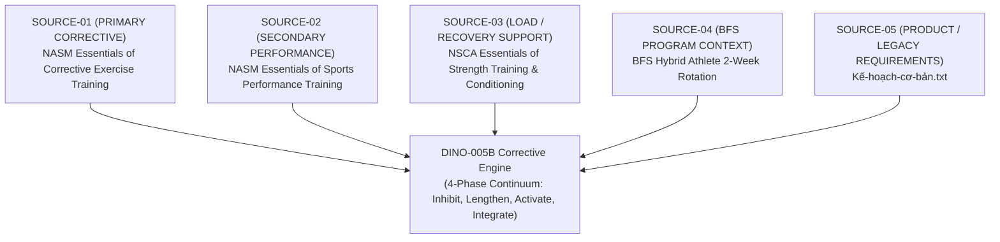

# DINO-005B — SOURCE REGISTER

> **Change Set:** DINO-005B — Prehab / Corrective Engine
> **Step:** STEP 01 — SOURCE INGESTION
> **Date:** 2026-09-28
> **Status:** REGISTERED / INVENTORY VERIFIED
> **Authority:** DINO (Project Owner) & ChatGPT (Product Architect)
> **Implementer:** Antigravity (Implementation Agent)

---

## 1. Baseline Safety Verification

| Check Item | Required Baseline | Observed Status | Verdict |
| :--- | :--- | :--- | :--- |
| **Git Branch** | `main` | `main` | PASS |
| **Current HEAD SHA** | `81aada51934c826f08dc6b75f24bb36f9e413c98` | `81aada51934c826f08dc6b75f24bb36f9e413c98` | PASS |
| **DINO-005A State** | `LOCKED` in `00_SYSTEM/DINO_SESSION_STATE.md` | `LOCKED` (Verified) | PASS |
| **Working Tree Status** | Clean (0 modified, 0 untracked files) | 100% Clean | PASS |
| **Application Files Modified** | 0 files | 0 files | PASS |

---

## 2. Source Hierarchy & Roles

In accordance with DINO-005B governance rules, source authority is strictly segmented into discrete operational tiers. **No role blending is permitted.**

### Hierarchy Definitions:
1. **PRIMARY CORRECTIVE SOURCE:** `NASM Essentials of Corrective Exercise Training`
   - Sole authority for the 4-phase Corrective Exercise Continuum (Inhibit $\rightarrow$ Lengthen $\rightarrow$ Activate $\rightarrow$ Integrate), movement impairment identification, kinetic chain checkpoints, and corrective exercise selection.
2. **SECONDARY PERFORMANCE SOURCE:** `NASM Essentials of Sports Performance Training`
   - Authority for warm-up integration, athletic performance warm-up structures, and transitioning corrective movements into athletic/running/soccer performance preparation.
3. **TRAINING / LOAD / RECOVERY SUPPORT:** `NSCA Essentials of Strength Training and Conditioning (4th Edition)`
   - Authority for volume/load/recovery management, RPE/fatigue interactions, work-to-rest parameters, and warm-up physiology (RAMP protocol context).
4. **BFS PROGRAM CONTEXT:** `BFS Hybrid Athlete 2-Week Rotation`
   - Project-specific preset program context; provides session schedules, muscle focus per training day, high-intensity/running/soccer load patterns, and where prehab slots attach.
5. **PRODUCT / LEGACY REQUIREMENTS:** `Kế-hoạch-cơ-bản.txt`
   - Original user expectations, legacy Vietnamese terminology, and product vision notes.

---

## 3. Source Inventory & Metadata Register

### SOURCE-01: NASM Essentials of Corrective Exercise Training
- **Source ID:** `SOURCE-01`
- **Exact Filename:** `Nasm Essentials Of Corrective Exercise Training -- National Academy Of Sports Medicine (nasm) -- ( WeLib.org ).pdf`
- **File Path:** `C:\Users\ADMIN\Downloads\Nasm Essentials Of Corrective Exercise Training -- National Academy Of Sports Medicine (nasm) -- ( WeLib.org ).pdf`
- **File Type:** PDF document (`%PDF-1.5`)
- **File Size:** 41,535,875 bytes (~41.5 MB)
- **Role in DINO-005B:** **PRIMARY CORRECTIVE SOURCE**
- **Purpose:** Foundational taxonomy and methodology for Prehab and Corrective exercise. Defines the 4-Phase Corrective Exercise Continuum (CEx Continuum), movement assessments (Overhead Squat, Single-Leg Squat), Kinetic Chain Checkpoints (Foot/Ankle, Knee, LPHC, Shoulder, Cervical Spine), muscle impairment classifications (Overactive / Underactive), and specific exercise modalities (Inhibit via SMR, Lengthen via Static/NMS stretching, Activate via Isolated Strengthening/Positional Isometrics, Integrate via Dynamic Movement).
- **Relevant Sections & Chapters:**
  - *Section 1: Introduction to Corrective Exercise Training*
    - Chapter 1: Rationale for Corrective Exercise
    - Chapter 2: Human Movement Science and the Corrective Exercise Continuum
  - *Section 2: Human Movement Assessments*
    - Chapter 4: Static Postural Assessments
    - Chapter 5: Movement Assessments (Overhead Squat Assessment, Single-Leg Squat Assessment, Push/Pull Assessments)
    - Chapter 6: Mobility / Range of Motion Assessments
  - *Section 3: The Corrective Exercise Continuum*
    - Chapter 8: Inhibitory Techniques (Self-Myofascial Release)
    - Chapter 9: Lengthening Techniques (Static & Neuromuscular Stretching)
    - Chapter 10: Activation Techniques (Isolated Strengthening & Positional Isometrics)
    - Chapter 11: Integration Techniques (Integrated Dynamic Movement)
  - *Section 4: Corrective Exercise Strategies*
    - Chapter 12: Foot and Ankle Impairments
    - Chapter 13: Knee Impairments
    - Chapter 14: Lumbo-Pelvic-Hip Complex (LPHC) Impairments
    - Chapter 15: Shoulder, Elbow, and Wrist Impairments
    - Chapter 16: Cervical and Thoracic Spine Impairments
- **Read Status:** **YES** (File exists, intact byte stream, valid PDF header, chapter structure identified).
- **Extraction Limitations:** Digital textbook in PDF format; raw binary file requires targeted page/chapter extraction in subsequent steps.

---

### SOURCE-02: NASM Essentials of Sports Performance Training
- **Source ID:** `SOURCE-02`
- **Exact Filename:** `NASM Essentials of Sports Performance Training -- Erin A. McGill and Ian Montel; McGill, Erin A., editor; -- ( WeLib.org ).pdf`
- **File Path:** `C:\Users\ADMIN\Downloads\NASM Essentials of Sports Performance Training -- Erin A. McGill and Ian Montel; McGill, Erin A., editor; -- ( WeLib.org ).pdf`
- **File Type:** PDF document (`%PDF-1.5`)
- **File Size:** 62,685,731 bytes (~62.7 MB)
- **Role in DINO-005B:** **SECONDARY PERFORMANCE SOURCE**
- **Purpose:** Governs athletic warm-up protocols, dynamic preparation, core/balance/reactive progressions, and sports-specific integration for running performance, sprint mechanics, change-of-direction, and field sport (soccer) pre-activation.
- **Relevant Sections & Chapters:**
  - *Section 1: Integrated Training for Sports Performance*
    - Chapter 1: Introduction to Integrated Sports Performance Training
  - *Section 3: The Integrated Sports Performance Continuum*
    - Chapter 6: Flexibility Training for Performance (Dynamic stretching and functional mobility)
    - Chapter 8: Core Training for Performance
    - Chapter 9: Balance Training for Performance
    - Chapter 10: Plyometric (Reactive) Training for Performance
    - Chapter 11: Speed, Agility, and Quickness (SAQ) Training
  - *Section 4: Periodization and Program Design for Sports Performance*
    - Chapter 13: Sports Performance Program Design
- **Read Status:** **YES** (File exists, intact byte stream, valid PDF header, chapter structure identified).
- **Extraction Limitations:** Large PDF document (~62.7 MB); textual and programmatic extraction must be scoped to warm-up and performance integration components.

---

### SOURCE-03: Essentials of Strength Training and Conditioning (4th Edition) — NSCA
- **Source ID:** `SOURCE-03`
- **Exact Filename:** `Essentials of Strength Training and Conditioning 4th Edition -- NSCA -National Strength & Conditioning Association -- ( WeLib.org ).pdf`
- **File Path:** `C:\Users\ADMIN\Downloads\Essentials of Strength Training and Conditioning 4th Edition -- NSCA -National Strength & Conditioning Association -- ( WeLib.org ).pdf`
- **File Type:** PDF document (`%PDF-1.6`)
- **File Size:** 41,930,294 bytes (~41.9 MB)
- **Role in DINO-005B:** **TRAINING / LOAD / RECOVERY SUPPORT**
- **Purpose:** Provides evidence-based guidelines on warm-up structure (RAMP protocol: Raise, Activate, Mobilize, Potentiate), fatigue management, muscle recovery timelines, resistance training volume/load distribution, and rehabilitation/reconditioning principles.
- **Relevant Sections & Chapters:**
  - *Section 3: Exercise Technique*
    - Chapter 14: Warm-Up and Flexibility Training (RAMP protocol, stretching modalities, temperature effects)
  - *Section 4: Program Design*
    - Chapter 17: Resistance Training Program Design (Exercise order, volume, rest periods)
    - Chapter 20: Program Design and Technique for Aerobic Endurance Training (Running load, recovery)
    - Chapter 22: Periodization (Load modulation, recovery microcycles)
    - Chapter 23: Rehabilitation and Reconditioning (Tissue healing phases, corrective loading)
- **Read Status:** **YES** (File exists, intact byte stream, valid PDF header, chapter structure identified).
- **Extraction Limitations:** Academic textbook in PDF format; extraction will focus on warm-up protocols and recovery/load interactions.

---

### SOURCE-04: BFS Hybrid Athlete 2-Week Rotation
- **Source ID:** `SOURCE-04`
- **Exact Filename:** `BFS_Hybrid_Athlete_2_Week_Rotation.docx`
- **File Path:** `c:\Users\ADMIN\Desktop\DinoHybridTracking\BFS_Hybrid_Athlete_2_Week_Rotation.docx`
- **File Type:** Microsoft Word OpenXML Document (`.docx` / ZIP XML)
- **File Size:** 44,534 bytes (~44.5 KB)
- **Role in DINO-005B:** **BFS PROGRAM CONTEXT**
- **Purpose:** Represents the specific operational training context in DINO. Establishes the real schedule, exercises, intensity targets, hybrid demands (Heavy Lifting + Zone 2 / Threshold Running + Saturday Soccer), and specific kinetic stressors to which prehab and corrective routines will attach.
- **Relevant Sections & Content:**
  - *Section 1: Mục tiêu & Nguyên tắc (Principles & Objectives: low work sets, high intensity, rest-pause, running & soccer preservation)*
  - *Section 2: Cấu trúc 2 tuần xoay vòng (Week A vs. Week B schedule)*
  - *Section 3: Chi tiết các buổi tập (Full Body A/B/C, Upper/Lower sessions, prescribed rep ranges 4–10)*
  - *Section 4: Kế hoạch chạy bộ & Conditioning (Zone 2, tempo, intervals)*
  - *Section 5: Phục hồi, dinh dưỡng & lưu ý an toàn*
- **Read Status:** **YES** (File exists in repository root, valid OpenXML structure, readable text parsed).
- **Extraction Limitations:** None. Document is locally present in workspace and fully parseable.

---

### SOURCE-05: Kế-hoạch-cơ-bản.txt
- **Source ID:** `SOURCE-05`
- **Exact Designation:** `Kế-hoạch-cơ-bản.txt` (Legacy Product Specification Notes)
- **Physical Source Status:** **NOT AVAILABLE** (Physical file does not exist on local filesystem; verified by exhaustive recursive scans).
- **Governance Record Status:** **RECONCILED / PROJECT-OWNER-AUTHORIZED** (Authoritative product/business requirements PR-001 to PR-004 originally authored by DINO during early app planning are formally articulated and locked in repository governance).
- **Scientific Authority:** **NONE** (Product & UX requirements only; does NOT constitute clinical or physiological evidence).
- **Role in DINO-005B:** **PRODUCT / BUSINESS REQUIREMENTS**
- **Provenance Classification:** All derived rules are strictly classified as `[DINO BUSINESS RULE]` or `[DINO DESIGN DECISION]`. They never override S01, S02, or S03 scientific facts.
- **Reconciled Scope & Approved Business Rules:**
  1. *Radio Button Exclusivity (`RULE-MEX-01 & 02` / PR-001):* Biomechanically opposing conditions (Anterior Pelvic Tilt vs. Posterior Pelvic Tilt; Knee Valgus vs. Knee Varus) must use mutually exclusive radio/toggle inputs.
  2. *Workout-Type Dependency (`RULE-CTX-01` / PR-002):* Corrective exercise recommendations must dynamically adapt to the scheduled training day (Upper, Lower, Running, Soccer, Offday).
  3. *Client-Side Determinism (`RULE-SYS-01` / PR-003):* Prehab engine must be rule-based, offline-executable, and completely decoupled from external LLM generation.
  4. *Two Operational Modes (`RULE-CTX-06` / PR-004):* Dual mode structure distinguishing compact pre-workout prehab (3–6 min, Mode A) from extended off-day recovery (12–20 min, Mode B).
- **Read Status:** **RECONCILED (GOVERNANCE SPECIFICATION RECORD)**

---

## 4. Governance Rule Compliance Notice

During this step (STEP 01 — SOURCE INGESTION):
1. **NO corrective rules have been created or inferred.**
2. **NO overactive or underactive muscle pairings have been synthesized.**
3. **NO inhibit, lengthen, activate, or integrate exercise mappings have been assigned.**
4. **NO application files (`js/`, `css/`, `index.html`, `sw.js`, `package.json`, `vercel.json`) have been modified.**
5. **Only source identification, location, metadata, and structural roles have been registered.**
